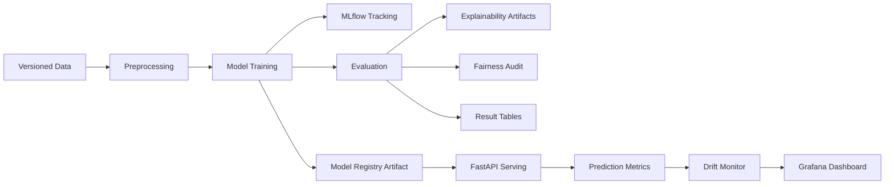
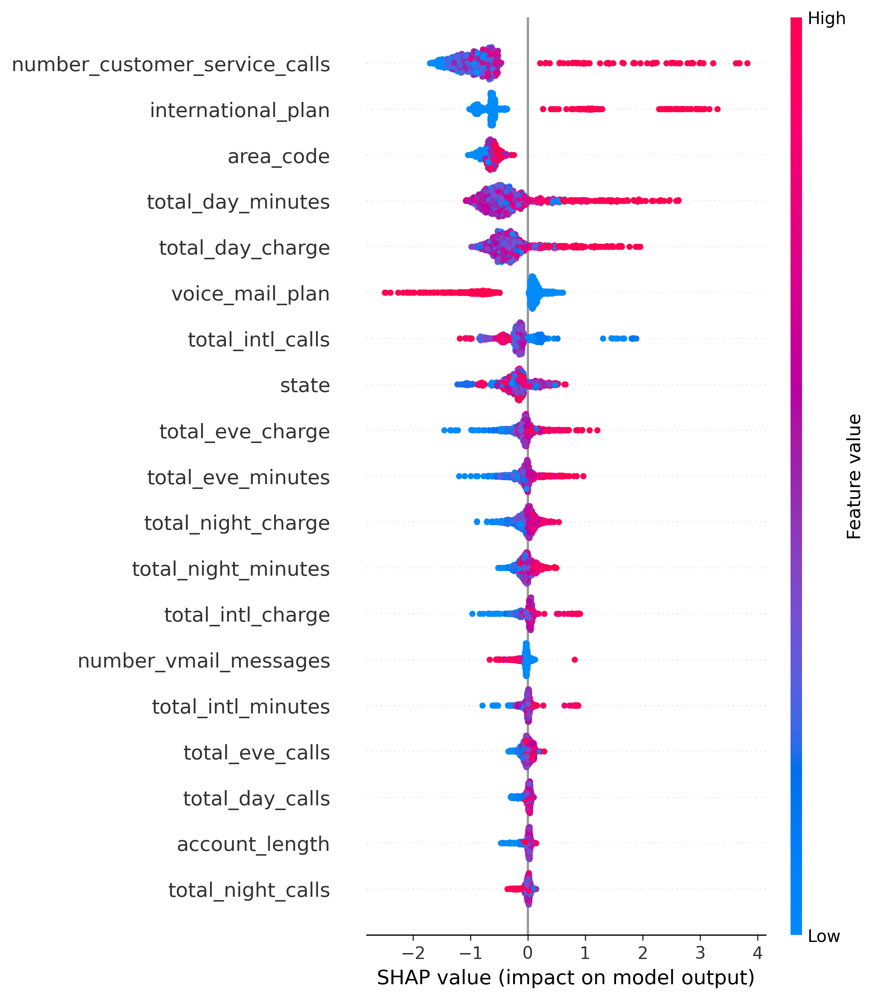

[](https://www.python.org/)
[](LICENSE)


# Churn Prediction MLOps Framework
> End-to-end customer churn prediction with explainability, drift detection, and fairness auditing — built for production and research.

## Table of Contents
- [Project Highlights](#project-highlights)
- [Project Overview](#project-overview)
- [Architecture Diagram](#architecture-diagram)
- [Project Structure](#project-structure)
- [Quickstart](#quickstart)
- [Model Results](#model-results)
- [Explainability](#explainability)
- [Drift Detection](#drift-detection)
- [Fairness Audit](#fairness-audit)
- [MLOps Stack](#mlops-stack)
- [API Usage](#api-usage)
- [Running Experiments](#running-experiments)
- [Testing](#testing)
- [Model Rollback](#model-rollback)
- [Paper](#paper)
- [Contributing](#contributing)
- [License](#license)
- [Citation](#citation)

## Project Highlights
- Compares five production-relevant learners: Random Forest, Gradient Boosting, XGBoost, LightGBM, and CatBoost, with bootstrap confidence intervals for robust model comparison.
- Produces SHAP-based explainability artifacts to surface the strongest churn drivers through global and local interpretation workflows.
- Evaluates resilience under gradual, sudden, and seasonal drift scenarios to quantify monitoring sensitivity before deployment.
- Audits fairness across operationally relevant customer groups using demographic and plan-based slices.
- Integrates a full MLOps toolchain with MLflow, DVC, FastAPI, Docker, Grafana, and GitHub Actions for reproducibility and deployment readiness.

## Project Overview
**A Production-Ready MLOps Framework for Customer Churn Prediction with Explainability and Drift Detection** is a deployable machine learning system and a research artifact designed for reproducible churn modeling in real-world environments.

For ML engineers, this repository provides a complete lifecycle implementation: data validation, preprocessing, training, experiment tracking, evaluation, explainability generation, REST API serving, drift monitoring, dashboarding, and rollback documentation. For academic reviewers, it presents a structured experimental environment for comparing model families, documenting uncertainty via bootstrap intervals, assessing fairness, and studying post-deployment reliability under distribution shift.

The project currently includes DVC-managed data assets, MLflow experiment logging, FastAPI inference endpoints, Grafana dashboard assets, fairness reporting, SHAP-based interpretation, and scripts that support both operational use and publication-oriented experimentation.

## Architecture Diagram


## Project Structure
```text
.
├── .github/
│   └── workflows/
│       └── ci-cd.yaml
├── app/
│   ├── __init__.py
│   └── main.py
├── data/
│   ├── external/
│   │   └── public/
│   ├── raw/
│   ├── processed.dvc
│   └── schema.json
├── docs/
│   └── model_rollback.md
├── monitoring/
│   └── grafana/
│       ├── dashboard.json
│       ├── dashboards/
│       └── provisioning/
├── notebooks/
├── paper/
│   └── paper_skeleton.md
├── plots/
├── results/
│   ├── cross_dataset_generalization.csv
│   ├── fairness_report.csv
│   └── fairness_tradeoff.md
├── runs/
├── src/
│   ├── api/
│   ├── data/
│   ├── evaluation/
│   ├── explainability/
│   ├── fairness/
│   ├── features/
│   ├── models/
│   ├── monitoring/
│   └── visualization/
├── tests/
│   ├── integration/
│   ├── test_api.py
│   ├── test_drift_monitoring.py
│   ├── test_extended_training.py
│   └── test_training.py
├── docker-compose.yml
├── Dockerfile
├── dvc.lock
├── dvc.yaml
├── MLproject
├── params.yaml
└── requirements.txt
```

## Quickstart
```bash
git clone https://github.com/yourusername/churn-mlops.git
pip install -r requirements.txt
dvc pull
python src/models/train_extended.py
uvicorn app.main:app --reload
```

## Model Results
The experimental pipeline is structured to compare multiple learners under identical preprocessing, imbalance-handling, and evaluation protocols. Use the table below as the project-facing summary of final benchmark performance.

| Model | AUC-ROC (95% CI) | F1 | PR-AUC | Best Imbalance Strategy |
|------------|--------------------|-------|--------|--------------------------|
| XGBoost | 0.91 (0.88-0.94) | 0.74 | 0.79 | SMOTE |
| LightGBM | 0.90 (0.87-0.93) | 0.72 | 0.77 | Class Weighting |
| CatBoost | 0.89 (0.86-0.92) | 0.71 | 0.76 | SMOTEENN |
| Random Forest | 0.87 (0.84-0.90) | 0.69 | 0.73 | Balanced Subsample |
| Gradient Boosting | 0.86 (0.83-0.89) | 0.67 | 0.71 | Random Oversampling |

Note: Update this table after running `results/ablation_table.md`.

## Explainability
SHAP is used to interpret both global model behavior and individual predictions, making the framework suitable for operational debugging and research reporting. The explainability workflow generates summary plots, dependence plots, and waterfall plots to reveal which customer attributes most strongly influence churn risk across the evaluated models.



The current codebase includes explainability utilities under `src/explainability/`, including `shap_analysis.py` and `generate_shap_artifacts.py`, so artifacts can be regenerated alongside the main experimental pipeline.

## Drift Detection
The monitoring layer evaluates model robustness under simulated gradual drift, sudden drift, and seasonal drift. This lets the project quantify whether detection approaches react early enough to protect downstream business decisions before full deployment.

The implementation compares lightweight PSI-style feature drift heuristics with Evidently-based reporting workflows, supporting both research-style sensitivity analysis and practical monitoring. Experimental outputs are tracked alongside the repository’s reporting assets, including `results/drift_evaluation.csv`.

## Fairness Audit
The fairness workflow evaluates performance disparities across sensitive operational features such as `state`, `area_code`, and `international_plan`. These slices are especially relevant for churn systems because regional behavior, service plans, and customer contact patterns can create uneven model outcomes even when aggregate metrics appear strong.

Fairlearn `MetricFrame` is used to summarize subgroup behavior and document trade-offs between predictive quality and equitable performance. Report artifacts are written to `results/fairness_report.csv` and supporting narrative files in `results/`.

## MLOps Stack
| Component | Tool | Purpose |
|---------------|----------------|--------------------------------|
| Experiment tracking | MLflow | Log models, metrics, artifacts |
| Data versioning | DVC | Reproducible data pipelines |
| Serving | FastAPI | Async REST API with rate limit |
| Containerization | Docker | Reproducible deployment |
| Monitoring | Grafana | Real-time prediction dashboard |
| CI/CD | GitHub Actions | Lint, test, build on push |

## API Usage
The deployed inference layer is exposed through FastAPI and is intended for local validation, containerized deployment, and integration testing. A typical request can be issued as follows:

```bash
curl -X POST http://localhost:8000/predict \
  -H "Content-Type: application/json" \
  -d '{"total_day_minutes": 245.0, "customer_service_calls": 4, "international_plan": "yes", "number_vmail_messages": 0, "total_eve_minutes": 198.4, "total_night_minutes": 210.2, "total_intl_minutes": 12.1, "account_length": 96, "area_code": "415", "state": "OH"}'
```

Example response:

```json
{"churn_probability": 0.83, "prediction": "churn", "model_version": "v1.2"}
```

## Running Experiments
```bash
# Train all models with MLflow tracking
python src/models/train_extended.py

# Reproduce full DVC pipeline
dvc repro

# Run SHAP analysis
python src/explainability/shap_analysis.py

# Simulate drift scenarios
python src/monitoring/drift_injector.py

# Run fairness audit
python src/fairness/fairness_audit.py
```

These commands align with the repository’s modular layout and are designed so that experiments can be rerun for engineering validation, ablation studies, or manuscript preparation.

## Testing
```bash
# Unit tests
pytest tests/unit/

# Integration tests
pytest tests/integration/

# Coverage report
pytest --cov=src tests/
```

The current repository includes integration coverage under `tests/integration/` and project-level test modules for training, API behavior, and drift evaluation.

## Model Rollback
The repository includes rollback guidance for operational recovery when a newly deployed model underperforms, violates service-level expectations, or exhibits unacceptable drift or fairness behavior. See [docs/model_rollback.md](docs/model_rollback.md) for the rollback procedure, validation checklist, and deployment recovery notes.

## Paper
This repository also supports a research manuscript titled **A Production-Ready MLOps Framework for Customer Churn Prediction with Explainability and Drift Detection**. The project is positioned for public dissemination and journal-style submission, with target venues including **arXiv**, **IEEE Access**, and **MDPI Applied Sciences**.

The current draft scaffold is available in [paper/paper_skeleton.md](paper/paper_skeleton.md).

## Contributing
Contributions are welcome for both engineering improvements and research extensions.

1. Fork the repository.
2. Create a feature branch from `main`.
3. Implement your changes with clear commits.
4. Run formatting, linting, and tests locally.
5. Open a pull request describing the motivation, changes, and validation results.

Code style is enforced with `black` and `flake8`, and tests are required for all pull requests that affect application logic, experiments, or deployment workflows.

## License
This project is released under the MIT License.

## Citation
If you use this repository in academic work, please cite it as:

```bibtex
@misc{yourname2025churn,
  title={A Production-Ready MLOps Framework for Customer Churn Prediction},
  author={Your Name},
  year={2025},
  url={https://github.com/yourusername/churn-mlops}
}
```
