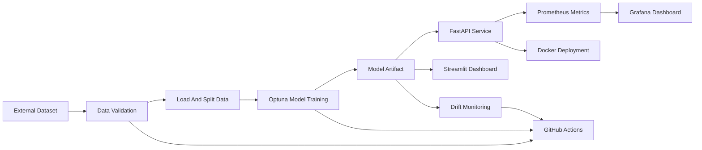

# Customer Churn MLOps Project

[](https://github.com/YASHASSHETTYYY/churn/actions/workflows/ci-cd.yaml)

Production-ready customer churn prediction project built to demonstrate the
full machine learning lifecycle: data validation, model training,
hyperparameter optimization, API serving, explainability, monitoring,
containerization, and CI/CD automation.

## Overview

This repository goes beyond offline model training. It packages the churn model
as a deployable service and adds the operational pieces expected in a real MLOps
system:

- validated input data and reproducible training steps
- Optuna-based hyperparameter optimization
- FastAPI prediction service with batch scoring
- SHAP explanations for individual predictions
- drift reporting for production monitoring
- Prometheus metrics and Grafana dashboard assets
- Docker-based local deployment
- staged GitHub Actions pipeline

## Tech Stack

- Python 3.11
- scikit-learn
- Optuna
- FastAPI
- Uvicorn
- Streamlit
- SHAP
- Evidently
- Prometheus
- Grafana
- Docker
- GitHub Actions
- pytest
- flake8

## Problem Statement

The project predicts whether a telecom customer is likely to churn. The current
training pipeline uses the selected model variables below:

- `number_vmail_messages`
- `total_day_calls`
- `total_eve_minutes`
- `total_eve_charge`
- `total_intl_minutes`
- `number_customer_service_calls`

Target:

- `churn`

Positive class:

- `yes`

## Architecture



## Repository Structure

```text
.
|-- .github/workflows/ci-cd.yaml      # Staged CI/CD pipeline
|-- dashboard/streamlit_app.py        # Interactive prediction dashboard
|-- monitoring/                       # Prometheus and Grafana configuration
|-- reports/                          # Generated reports and training outputs
|-- src/
|   |-- api/app.py                    # FastAPI serving layer
|   |-- config.py                     # Shared config/path utilities
|   |-- data/
|   |   |-- load_data.py              # Raw data loading
|   |   |-- split_data.py             # Train/test split
|   |   `-- validate_data.py          # Dataset validation
|   |-- models/
|   |   |-- predict.py                # Shared prediction and SHAP logic
|   |   |-- train_model.py            # Optuna training pipeline
|   |   |-- production_model_selection.py
|   |   `-- model_monitor.py
|   `-- monitoring/drift_report.py    # Drift reporting job
|-- Dockerfile
|-- docker-compose.yml
|-- params.yaml
`-- requirements.txt
```

## Key Features

### 1. Hyperparameter Optimization

The training pipeline uses Optuna with Bayesian optimization to search for
better Random Forest hyperparameters. Best parameters and evaluation metrics are
saved automatically.

Generated outputs:

- `models/churn_model.joblib`
- `reports/model_metrics.json`
- `reports/best_params.json`

### 2. Prediction API

The FastAPI application exposes:

- `GET /`
- `GET /health`
- `POST /predict`
- `POST /predict/batch`
- `POST /explain`
- `GET /metrics`

The API supports:

- schema validation with Pydantic
- single-record predictions
- batch predictions
- SHAP-based explanations
- Prometheus metrics for monitoring

### 3. Drift Monitoring

The drift monitoring job compares reference and current datasets and generates:

- `reports/drift_report.html`
- `reports/drift_report.json`

When Evidently is supported by the runtime, it produces the report directly.
If Evidently cannot initialize in the environment, the job falls back to a
lightweight HTML summary instead of failing the pipeline.

### 4. Interactive Dashboard

The Streamlit dashboard allows:

- manual feature entry
- churn scoring
- SHAP top-factor display
- batch CSV upload and download

### 5. Monitoring And Observability

The API exports metrics designed for operational dashboards:

- `prediction_requests_total`
- `prediction_errors_total`
- `model_latency_seconds`
- `model_error_rate`

Prometheus scrapes the metrics endpoint and Grafana is preconfigured with a
basic monitoring dashboard.

### 6. CI/CD Pipeline

The GitHub Actions workflow is intentionally split into visible stages to show
the end-to-end MLOps flow clearly:

- `Validate Data`
- `Test And Lint`
- `Train Model`
- `Monitor Drift`
- `Build Docker Image`
- `Publish Image`
- `Deploy`

Push and pull request runs stop at validation, testing, training, monitoring,
and image build by default. Image publishing and deployment are opt-in.

## Configuration

Project configuration lives in `params.yaml`.

Important settings:

- training artifacts path
- number of Optuna trials
- cross-validation folds
- model search space
- drift report paths
- API host and port

## Local Setup

Recommended environment:

- Python 3.11

Create and activate a virtual environment:

```powershell
cd d:\mlops_project\mlops-project-customer-churn
py -3.11 -m venv .venv
.venv\Scripts\Activate.ps1
python -m ensurepip --upgrade
python -m pip install --upgrade pip setuptools wheel
python -m pip install -r requirements.txt
```

## Run The Full Pipeline Locally

### Step 1. Validate Data

```powershell
python src\data\validate_data.py --config params.yaml
```

### Step 2. Prepare Data

```powershell
python src\data\load_data.py --config params.yaml
python src\data\split_data.py --config params.yaml
```

### Step 3. Train The Model

```powershell
python src\models\train_model.py --config params.yaml --n-trials 10
```

### Step 4. Generate Drift Report

```powershell
python src\monitoring\drift_report.py --config params.yaml
```

## Run The API

```powershell
python -m uvicorn src.api.app:app --host 0.0.0.0 --port 8000 --reload
```

Open:

- API root: `http://127.0.0.1:8000/`
- health check: `http://127.0.0.1:8000/health`
- Swagger docs: `http://127.0.0.1:8000/docs`

### Example Prediction Request

```powershell
curl -X POST "http://127.0.0.1:8000/predict" `
  -H "Content-Type: application/json" `
  -d "{\"number_vmail_messages\":12,\"total_day_calls\":112,\"total_eve_minutes\":175.5,\"total_eve_charge\":14.92,\"total_intl_minutes\":10.4,\"number_customer_service_calls\":2}"
```

### Example Batch Request

```json
{
  "customers": [
    {
      "number_vmail_messages": 12,
      "total_day_calls": 112,
      "total_eve_minutes": 175.5,
      "total_eve_charge": 14.92,
      "total_intl_minutes": 10.4,
      "number_customer_service_calls": 2
    },
    {
      "number_vmail_messages": 0,
      "total_day_calls": 90,
      "total_eve_minutes": 210.0,
      "total_eve_charge": 17.85,
      "total_intl_minutes": 13.1,
      "number_customer_service_calls": 4
    }
  ]
}
```

## Run The Streamlit Dashboard

In a second terminal:

```powershell
cd d:\mlops_project\mlops-project-customer-churn
.venv\Scripts\Activate.ps1
python -m streamlit run dashboard\streamlit_app.py
```

Open:

- Dashboard: `http://127.0.0.1:8501`

## Run With Docker

The repository includes a containerized stack for the API, dashboard,
Prometheus, and Grafana.

```powershell
docker-compose up --build
```

Available services:

- FastAPI: `http://localhost:8000`
- Streamlit: `http://localhost:8501`
- Prometheus: `http://localhost:9090`
- Grafana: `http://localhost:3000`

## Testing And Code Quality

Run linting:

```powershell
python -m flake8 --jobs 1 src tests dashboard app.py
```

Run tests:

```powershell
python -m pytest -q tests
```

## GitHub Actions Workflow

Workflow file:

- `.github/workflows/ci-cd.yaml`

Manual workflow options:

- `model_trials`
- `publish_image`
- `trigger_deploy`

Automatic image publishing is disabled unless the repository variable
`AUTO_PUBLISH_IMAGE=true` is set.

If you enable image publishing, the workflow pushes the container image to:

- `ghcr.io/<owner>/customer-churn`

If you enable deployment, configure:

- `DEPLOY_WEBHOOK_URL`

## Generated Artifacts

Important generated outputs:

- `models/churn_model.joblib`
- `reports/model_metrics.json`
- `reports/best_params.json`
- `reports/data_validation.json`
- `reports/drift_report.html`
- `reports/drift_report.json`

## Troubleshooting

### Missing dependencies in the virtual environment

If commands fail with `ModuleNotFoundError`, the dependencies were not fully
installed. Re-run:

```powershell
python -m pip install -r requirements.txt
```

### Python 3.13 compatibility

Use Python 3.11 for local development. Some monitoring dependencies, especially
Evidently, can fail on Python 3.13 depending on the installed package set.

### GitHub Actions publish and deploy

If the workflow cannot publish the image:

- enable package write permission for GitHub Actions
- verify that GHCR access is allowed for the repository

If deployment does not run:

- make sure `publish_image` is enabled in manual dispatch
- make sure `trigger_deploy` is enabled in manual dispatch
- make sure `DEPLOY_WEBHOOK_URL` is configured

## License

This project is released under the MIT License.
